# Generative Adversarial Networks

PyTorch reimplementation of the following GAN related papers:

* ["Generative Adversarial Networks"](https://arxiv.org/abs/1406.2661) (Goodfellow et al., 2014)

* ["Conditional Generative Adversarial Nets"](https://arxiv.org/abs/1411.1784) (Mirza et al., 2014)

* ["Unsupervised Representation Learning with Deep Convolutional Generative Adversarial Networks"](https://arxiv.org/abs/1511.06434) (Radford et al., 2016)

**Note: This repository implements early GAN architectures for educational purposes. As these methods are older, the results may be of poor quality.**

| GAN (MNIST) | CGAN (MNIST) | DCGAN (CA) |
| ------------ | ----------- | -------------- |
| 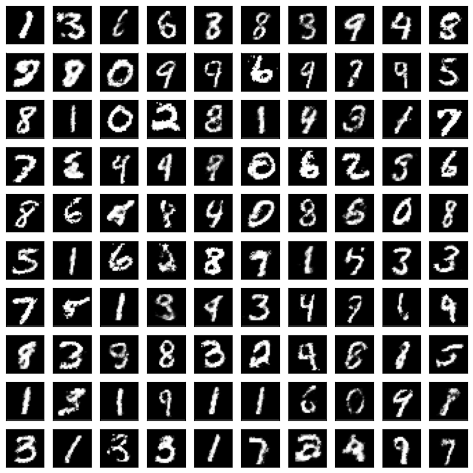 | 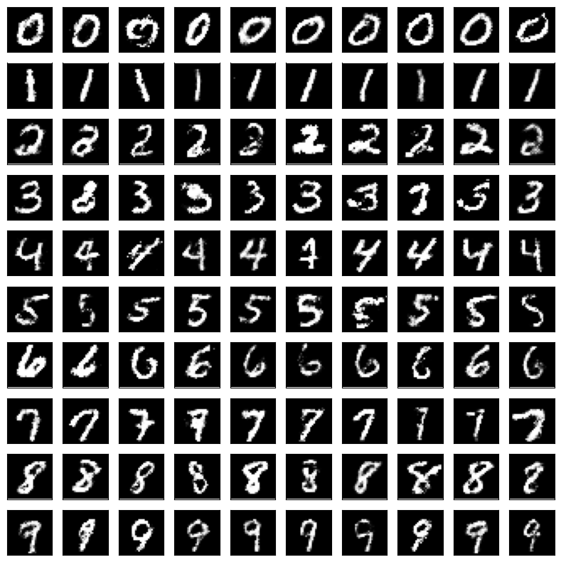 | 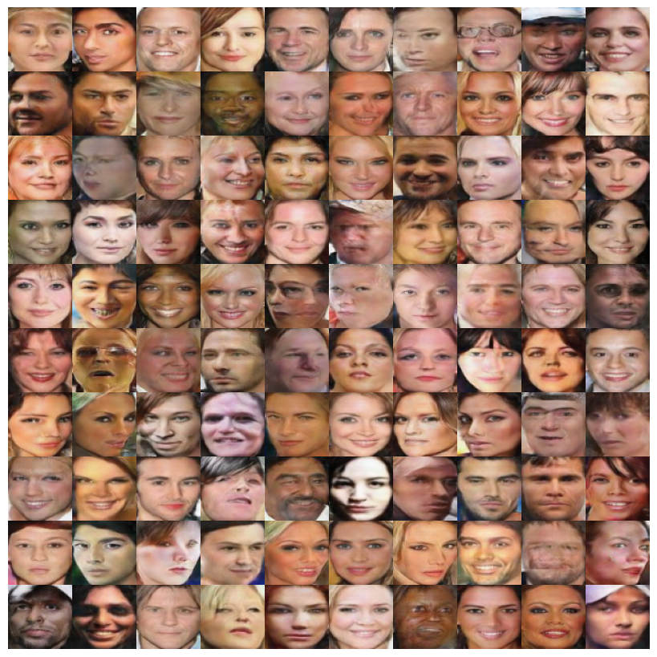 |
| 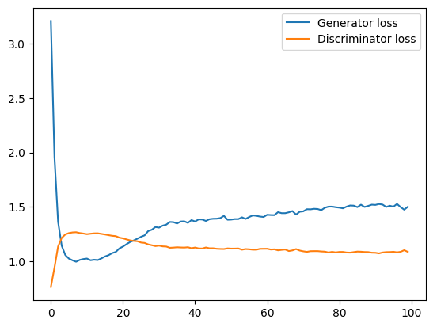 |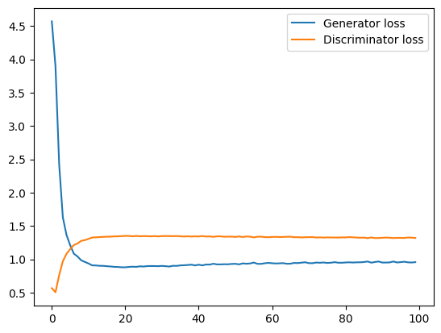 | 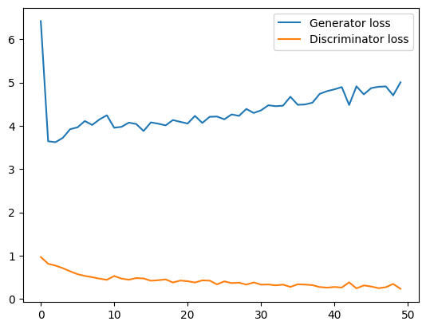 |

## GAN and CGAN

[This code](./src/models/gan.py) implements the fully connected generator and discriminator for the MNIST dataset as described in Goodfellow et al. (2014), ["Generative Adversarial Networks"](https://arxiv.org/abs/1406.2661).

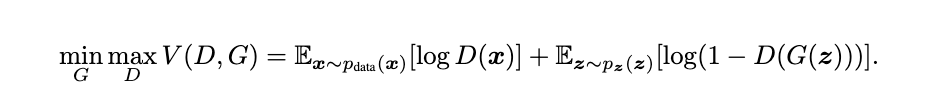
*Figure 1: The original GAN objective, where G denotes the generator and D the discriminator (Goodfellow et al., 2014).*

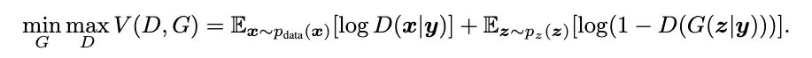

*Figure 2: The CGAN objective, where G denotes the generator and D the discriminator (Mirza and Osindero, 2014).*

Note: Original code and hyperparameters from the paper can be found [here](https://github.com/goodfeli/adversarial).

### Training

Just run:

```bash
python3 train_gan.py
```

## DCGAN

[This code](./src/models/dcgan_v1.py) implements the deep convolutional generator and discriminator for the CelebA dataset as described by Radford et al. (2016).

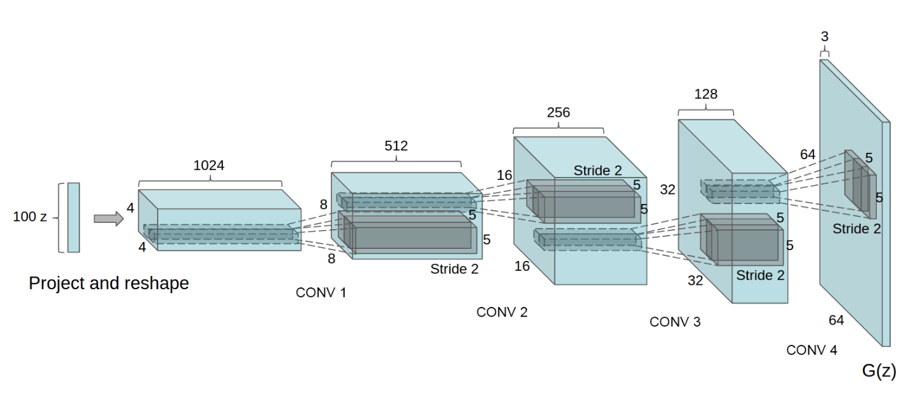
*Figure 3: DCGAN generator used for CelebA (Radford et al., 2016).*

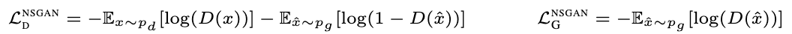
*Figure 4: Loss of the discriminator and generator (Lucic et al., 2018).*

### Large-scale CelebFaces Attributes (CelebA) Dataset

#### 1. Data collection

Download CelebA from one of the two sources:

* [https://mmlab.ie.cuhk.edu.hk/projects/CelebA.html](https://mmlab.ie.cuhk.edu.hk/projects/CelebA.html)
* [https://www.kaggle.com/datasets/jessicali9530/celeba-dataset](https://www.kaggle.com/datasets/jessicali9530/celeba-dataset)

Ensure the data folder supports the following tree structure and naming convention:

```bash
|-- celeba
|   |-- data  // image folder or prepro_data folder
|   |-- landmarks.csv
```

#### 2. Preprocessing (optional)

The original CelebA dataset consists of human faces with diverse backgrounds.
However, working with human faces and diverse backgrounds makes it difficult for the DCGAN generator.
To make his life more easy, I used a pretrained YOLOv8 medium (v0.2) face detector to extract tight face crops from the original CelebA images (see in [prepro.py](./utils/prepro.py)).

Ensure you download the pretrained weights of [YOLOv8 medium](https://github.com/ultralytics/ultralytics), and specify the path to the data directory in `./src/utils/prepro.py`. After that, you are ready to run:

```bash
python3 ./src/utils/prepro.py
```

**NOTE: The preprocessing step using the YOLOv2 model is optional.**

#### 3. Training

Modify the trainig script `train_dcgan.py` to point to your data directory.
This script will train both the generator and discriminator on the CelebA dataset.

```bash
python3 train_dcgan.py
```

#### 4. Inference: Generated bedrooms using the DCGAN generator

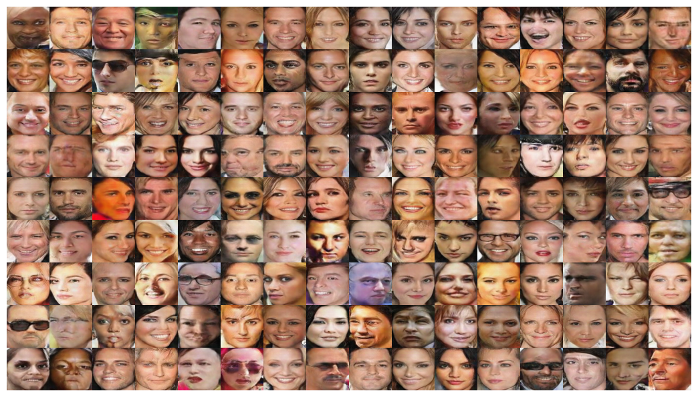
*Figure 3: Image generated by DCGAN generator by follwoing the instructions from this repository.*

#### Manifold Interpolation

Using the trained generator you can easily interpolate two noise samples, and project them using the generator as follows:

```python
# Generator output shape is [1, 3, 64, 64]

noise_start = torch.rand((1, 100))*2 - 1  # shape [1, 100]
noise_end = torch.rand((1, 100))*2 - 1    # shape [1, 100]

n_steps = 16
steps = torch.linspace(0, 1, n_steps)     # shape [n_steps,]

zs = []
for i in range(n_steps):
      alpha = steps[i]
      z = (1-alpha)*noise_start + alpha*noise_end
inter_noise = torch.cat(zs, dim=0)        # shape [n_steps, 100]

fake_imgs = generator(inter_noise)        # shape [n_steps, 3, 64, 64]
```

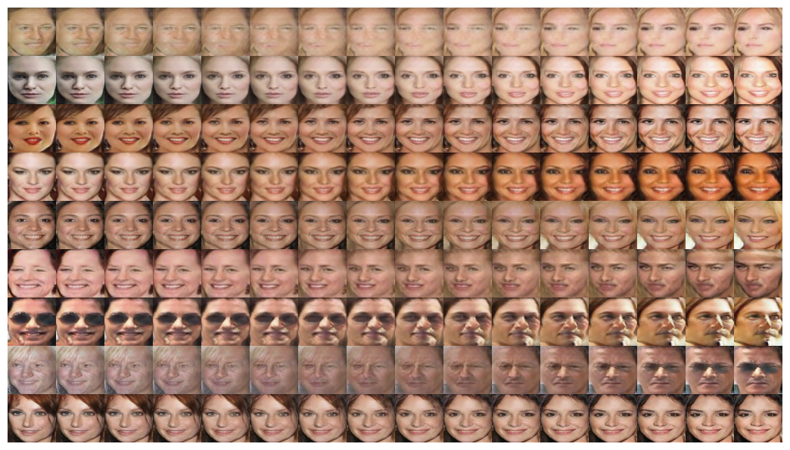
*Figure 5: Interpolation between a series of 9 noise samples. All noise samples were projected using the trained DCGAN generator (from left-to-right).*

## Experimental setup

* OS: Fedora Linux 42 (Workstation Edition) x86_64
* CPU: AMD Ryzen 5 2600X (12) @ 3.60 GHz
* GPU: NVIDIA GeForce RTX 3060 ti (8GB VRAM)
* RAM: 32 GB DDR4 3200 MHz

* CelebA training time: < 3 hours

## Citations

```bibtex
@misc{radford2016unsupervisedrepresentationlearningdeep,
      title={Unsupervised Representation Learning with Deep Convolutional Generative Adversarial Networks}, 
      author={Alec Radford and Luke Metz and Soumith Chintala},
      year={2016},
      eprint={1511.06434},
      archivePrefix={arXiv},
      primaryClass={cs.LG},
      url={https://arxiv.org/abs/1511.06434}, 
}
```

```bibtex
@misc{goodfellow2014generativeadversarialnetworks,
      title={Generative Adversarial Networks}, 
      author={Ian J. Goodfellow and Jean Pouget-Abadie and Mehdi Mirza and Bing Xu and David Warde-Farley and Sherjil Ozair and Aaron Courville and Yoshua Bengio},
      year={2014},
      eprint={1406.2661},
      archivePrefix={arXiv},
      primaryClass={stat.ML},
      url={https://arxiv.org/abs/1406.2661}, 
}
```

```bibtex
@misc{lucic2018ganscreatedequallargescale,
      title={Are GANs Created Equal? A Large-Scale Study}, 
      author={Mario Lucic and Karol Kurach and Marcin Michalski and Sylvain Gelly and Olivier Bousquet},
      year={2018},
      eprint={1711.10337},
      archivePrefix={arXiv},
      primaryClass={stat.ML},
      url={https://arxiv.org/abs/1711.10337}, 
}
```

```bibtex
@inproceedings{liu2015faceattributes,
  title = {Deep Learning Face Attributes in the Wild},
  author = {Liu, Ziwei and Luo, Ping and Wang, Xiaogang and Tang, Xiaoou},
  booktitle = {Proceedings of International Conference on Computer Vision (ICCV)},
  month = {December},
  year = {2015} 
}
```

```bibtex
@article{yu15lsun,
    Author = {Yu, Fisher and Zhang, Yinda and Song, Shuran and Seff, Ari and Xiao, Jianxiong},
    Title = {LSUN: Construction of a Large-scale Image Dataset using Deep Learning with Humans in the Loop},
    Journal = {arXiv preprint arXiv:1506.03365},
    Year = {2015}
}
```